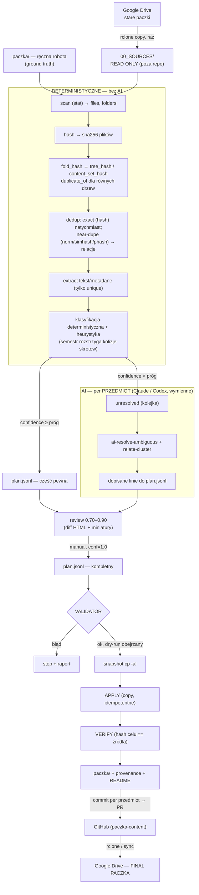
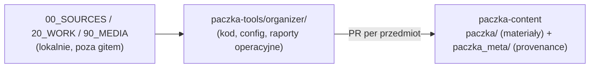
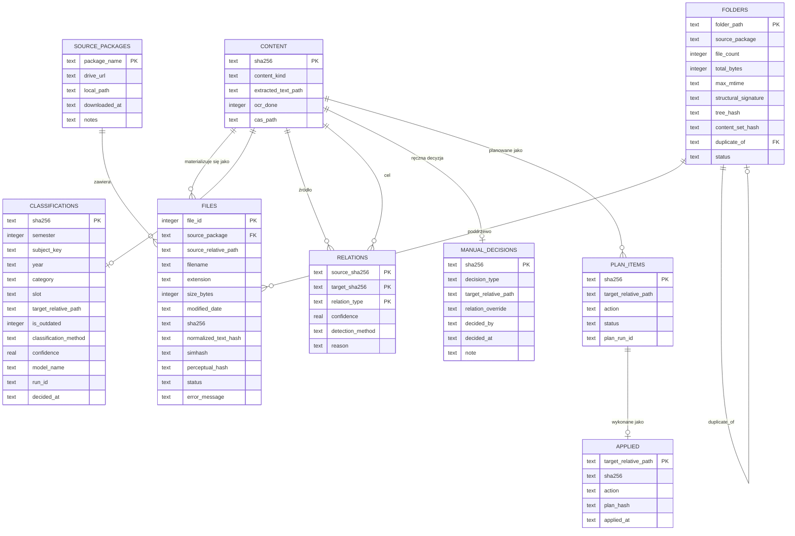
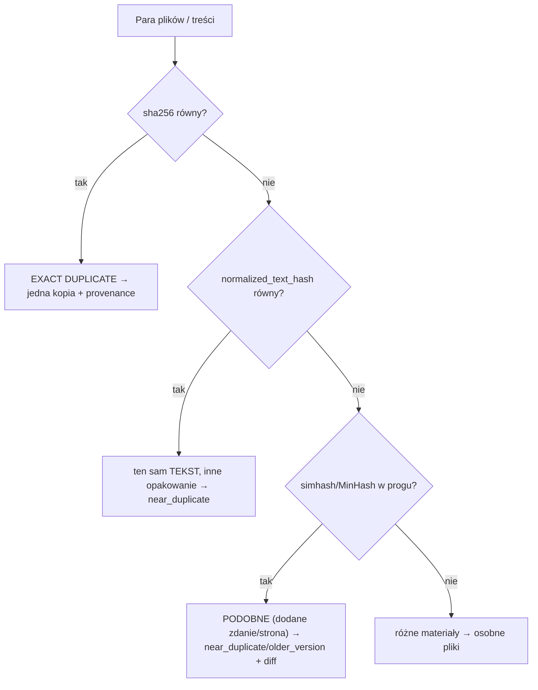
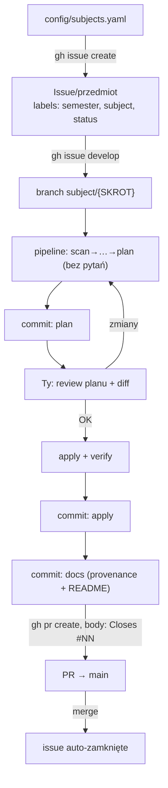
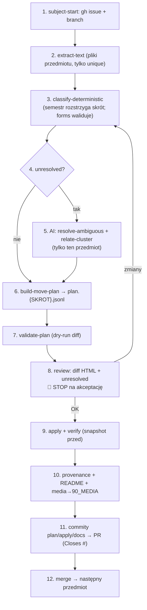

# Paczka Organizer — Architektura FINAL v1

Jeden dokument zbierający wszystkie ustalenia z projektowania (v1–v4 + finalne
decyzje). Zastępuje wcześniejsze wersje jako źródło prawdy o architekturze.
Skrypty jeszcze nie istnieją — to jest kontrakt, według którego je zbudujemy.

Spis:
1. Cel i zasady nadrzędne
2. Architektura wysokopoziomowa (pipeline)
3. Repo i układ katalogów
4. Model danych (ERD + tabele)
5. Deduplikacja: 3 warstwy + hash folderów
6. Klasyfikacja (deterministyczna → heurystyka → AI) i kolizje skrótów
7. Provenance
8. move-plan i validator
9. Review i widoczność stanu
10. Media
11. Git: issue → PR → merge
12. AI: Claude/Codex wymienne, minimalizacja tokenów
13. **Plan działania (pierwszy przebieg + uniwersalny per-przedmiot)**
14. Rozszerzalność na kolejne roczniki
15. Stos technologiczny

---

## 1. Cel i zasady nadrzędne

Scalić 4–5 starych „paczek" (~40 GiB, mocno się dublują i zagnieżdżają) w jedną
uporządkowaną paczkę, tak by:
- skrypty robiły wszystko deterministyczne, a AI tylko rozumienie treści,
- minimalizować tokeny, dało się wznawiać, było bezpiecznie i powtarzalnie,
- zachować provenance i łatwo dorzucać materiały za kilka lat.

Reguły twarde (pełne w `CLAUDE.md`): `00_SOURCES` read-only; `paczka/` kanoniczna;
deterministyka najpierw, AI na końcu; dokładne duplikaty tylko po hashu; nic nie
kasujemy automatycznie; jeden przedmiot na raz; provenance zawsze; plan przed
zmianami; AI nie dotyka dysku (jego wyjście to `plan.jsonl`); `outdated` tylko
przez review; media poza paczką.

**Kluczowa filozofia:** AI nie jest etapem pipeline'u, tylko funkcją wołaną na
resztkach. Cały deterministyczny pipeline buduje się i uruchamia *zanim* dotkniemy
modelu. Każdy plik, który AI w ogóle zobaczy, to mierzona lokalna porażka
klasyfikatora deterministycznego.

---

## 2. Architektura wysokopoziomowa



---

## 3. Repo i układ katalogów

Pełna mapa organizacji: [`ORGANIZACJA.md`](ORGANIZACJA.md). Skrót istotny dla
architektury:

### Decyzja (P2)
Organizacja jest **multi-repo**. Organizer to **jednorazowe, nie-deployowane
narzędzie** — mieszka jako projekt w **`paczka-tools/organizer/`** (obok
`ects_extractor` i innych). **Nie** jest osobnym repo (byłoby rozmnażanie repo dla
one-shota) i **nie** siedzi w `paczka-content` (to repo ma być cienkie). Materiały
produkuje jako **PR-y do `paczka-content`**. 40 GiB źródeł i katalogi robocze są
**poza gitem** (lokalnie).



### Struktura projektu organizer (to repo/folder)

```
paczka-tools/organizer/
├── CLAUDE.md  AGENTS.md              # zasady pracy AI (scoped do projektu)
├── README.md  SKILLS.md
├── docs/
│   ├── ARCHITEKTURA_FINALv1.md       # ten dokument
│   ├── ORGANIZACJA.md                # mapa repozytoriów i organizacji
│   └── SOURCES_TREE.md               # snapshot drzewa źródeł (ślad, generowany)
├── config/   (paths.yaml, subjects.yaml, syntax.yaml, thresholds.yaml — syntax.yaml pełni rolę taksonomii)
├── prompts/  (classify_ambiguous, relate_cluster)
├── scripts/  (etapy pipeline)
└── reports/  (inventory, plany, provenance-operacyjne — w gicie)
```

Katalogi lokalne (poza gitem, ścieżki w `config/`):
```
00_SOURCES/   # 40 GiB stare paczki, read-only, backup na Drive
20_WORK/      # organizer.sqlite, extracted_text, thumbnails
90_MEDIA/     # duże wideo/audio wyjęte z paczki
```

### Gdzie trafia wynik
- Materiały (PDF/obrazy) → `paczka/SEM{n}/({SKROT})_{Nazwa}/...` w klonie repo
  docelowego (`config/paths.yaml: target_repo` — **dziś `10_NEW/PaczkaInfaPG`**, docelowo
  `paczka-content`), na branchu `subject/{SKROT}`, przez PR per przedmiot.
- Provenance + README pakietu (dla użytkownika) → `paczka-content/paczka_meta/`.
- Manifesty, plany, provenance-operacyjne, `manual_decisions.jsonl` →
  `paczka-tools/organizer/reports/` (tekstowe, w gicie).

### „Ślad struktury, z jaką pracowaliśmy" (P2b)
Nie trzymamy pustych, zignorowanych `00/20/90` w repo. Ślad = commitowany
`reports/inventory.jsonl` (każdy plik źródłowy: hash, rozmiar, paczka, provenance)
+ `docs/SOURCES_TREE.md` (tekstowy snapshot drzewa `00_SOURCES`). Realna,
przeszukiwalna, diffowalna wiedza „co tam było" bez ładowania binariów do gita.

---

## 4. Model danych (SQLite = operacyjne źródło prawdy)

SQLite trzyma stan; CSV/JSONL to eksporty (audyt + kontrakt AI). `organizer.sqlite`
jest w `20_WORK` (poza gitem, odtwarzalne); **ręczne decyzje eksportowane do
`reports/manual_decisions.jsonl`** (w gicie), by przeżyły przebudowę bazy.



Uwaga: `CLASSIFICATIONS` ma `semester` obok `subject_key`, bo **skrót nie jest
unikalny** — para (semester, subject_key) jest tożsamością przedmiotu.

State machine statusu pliku (wznawialność + idempotencja):
`discovered → hashed → extracted → classified → planned → applied → verified`.
Każdy etap bierze z bazy „co niedokończone", przesuwa status do przodu, nigdy nie
robi tej samej pracy dwa razy. Zapisy = UPSERT po sha256 / (pack, rel_path).

---

## 5. Deduplikacja: 3 warstwy + hash folderów



- **sha256** — identyczne bajty (jedyne, co zeruje tokeny AI; zero fałszywych trafień).
- **normalized_text_hash** — ten sam tekst po normalizacji (re-eksport, docx→pdf).
  Uwaga: to wciąż hash — **nowego zdania w środku NIE złapie**.
- **simhash/MinHash** — podobieństwo; przeżywa wstawki i drobne edycje.
- **phash** — obrazy.

**Hash folderów** (Merkle): `tree_hash` = hash z posortowanych `(relpath, sha256)`
→ całe równe drzewo dostaje `duplicate_of` i staje się **tylko-provenance**
(pomijamy dla niego extract/OCR/classify/AI). `content_set_hash` = multizbiór
samych sha256 (ta sama treść mimo innych nazw). Tani `structural_signature` (z
`stat`) → kandydaci na dubel bez czytania plików i skip niezmienionych poddrzew na
re-runach. Bootstrap gotowcem: `rmlint --merge-directories`.

Nakładające się źródła (`Paczki Infa` vs `INFA`, `AKO2020` w dwóch miejscach)
**nie wymagają ręcznego sprzątania** — foldery nie są tożsamością, treść jest.
Exact (plik/folder) → dedup od razu; częściowe pokrycie → `folder_overlap.csv`.

---

## 6. Klasyfikacja i kolizje skrótów

Kolejność: deterministyczna (ścieżka/nazwa/struktura) → heurystyka (regex: lab,
kol, egzamin, rok, prowadzący) → AI tylko dla `unresolved`.

**Ścieżki źródłowe mają różną głębokość** — więc przedmiot/semestr rozpoznajemy
przez **dopasowanie nazw komponentów ścieżki gdziekolwiek w niej** (fuzzy, aliasy
z `subjects.yaml`), nie po pozycji.

**Skrót NIE jest unikalny.** Tożsamość = (semestr, skrót). Semestr bierzemy ze
ścieżki docelowej i to on rozstrzyga kolizje: `AK` (Architektura sem3 vs Animacja
sem7), `PO`, `SI`, `SK`, `ASK`, `JAI`, `WFI`, `PGI`, `PDII`, `SDII`. W źródłach
`AK` bywa `AKO` — to alias, nie nowy przedmiot.

`forms` z `subjects.yaml` (W/C/L/P/S) to sygnał walidacyjny: nie klasyfikuj pliku
do kategorii, której przedmiot nie ma (np. ME = tylko W,C → brak laboratoriów).

Progi (w `thresholds.yaml`): ≥0.90 auto, 0.70–0.90 review, <0.70 unresolved.

---

## 7. Provenance

Wynika z modelu danych: jedna treść (`sha256`) ma wiele źródeł (`files`). Na
wyjściu materializowana jako `reports/provenance.jsonl` + generowane per-przedmiot
`README.md`. Bez rozsypywania sidecarów przy każdym pliku. `source_packages`
trzyma link do paczki na Drive → generujemy `00_SOURCES/linki.txt`.

---

## 8. move-plan i validator

`plan.jsonl` — jedna decyzja/linia, operuje na `sha256` (stabilne wobec zmian
nazw), z `_meta` (schema_version, subject_key, semester, plan_hash, generated_by).
Pola: action (copy/quarantine/skip), source_sha256, source_paths, target_rel,
category, is_outdated, relation/related_to, confidence, method, model, reason,
needs_review.

Validator (bramka przed `apply`): schema OK; source_sha256 istnieje; target pod
`paczka/`, bez `..`, zgodny z `syntax.yaml` + lint nazw; brak kolizji (ten sam
target różna treść = błąd); bramka confidence; integralność relacji; **dry-run
diff** (drzewo + liczby). Twardy błąd → exit≠0, żadnego apply.

---

## 9. Review i widoczność stanu

- **Diff near-dupe:** `difflib.HtmlDiff` na wyciągniętym tekście + miniatury
  obrazów → człowiek ocenia „literówka vs inny zakres". Decyzje → `manual`
  (conf=1.0), trwałe.
- **Checklista/status:** generowany `STATUS.md` (przedmioty × etapy + liczby:
  plików, % auto, unresolved, do review) + per-przedmiot README. Docelowo graf
  relacji w Twoim `synapse` (notatki `.md` z wikilinkami — do wpięcia po pilotażu).

---

## 10. Media

Duże wideo/audio (> próg z `syntax.yaml`, domyślnie 25 MiB) **nie wchodzą do
paczki** → kopiowane do `90_MEDIA/{skrot}/...` (poza repo) + wpis w
`inne/nagrania.txt`: `opis | ścieżka_w_90_MEDIA | <link_do_uzupełnienia>`.
Po uploadzie na YT podmieniasz link. Provenance media też w bazie.

---

## 11. Git: issue → PR → merge

Jednostka wszystkiego = przedmiot.



Commity semantyczne: `plan(SKROT)` → `apply(SKROT)` → `docs(SKROT)`. Owinięte w
`just subject-start/plan/apply/pr`. Issues generowane automatycznie z listy
przedmiotów — nie klikane ręcznie.

---

## 12. AI: Claude/Codex wymienne, tokeny

Agent = czysta funkcja `manifest_slice.jsonl → plan.jsonl`, nie dotyka dysku.
Za `llm_client.py` chowamy backend (anthropic / openai / `claude -p` / `codex
exec`) — wybór w configu. Dwa tryby: masowe `classify_one` przez API/headless;
trudne `relate_cluster` + orkiestracja interaktywnie.

Tokeny: dedup przed extract przed classify; nigdy binariów (tylko nazwa+ścieżka+
głowa tekstu ~1–2 KB); cache decyzji po sha256; struktura raz na sesję; poddrzewa
`duplicate_of` pomijają AI; mniejszy model do classify, większy tylko do relacji.

---

## 13. Plan działania

### A. Pierwszy przebieg (jednorazowy — budowa fundamentu + mapa)

```mermaid
flowchart LR
    S0["0. Bootstrap<br/>rmlint + ncdu<br/>(skala dublowania)"] --> S1["1. Szkielet repo<br/>utility/organizer + config + schemat"]
    S1 --> S2["2. Import listy → subjects.yaml<br/>(gotowe) + syntax/thresholds"]
    S2 --> S3["3. scan (stat) → files, folders<br/>+ SOURCES_TREE.md"]
    S3 --> S4["4. hash plików → content<br/>(dedup plików)"]
    S4 --> S5["5. fold_hash → duplicate_of<br/>+ folder_overlap.csv"]
    S5 --> S6["6. dedup + size report<br/>(unique vs duplicate)"]
    S6 --> S7["7. Skan istniejącej paczki/<br/>= ground truth (lock)"]
    S7 --> PILOT["→ pilotaż jednego przedmiotu"]
```



Kroki 0–7 są **wspólne dla całości** i robione raz. Dają mapę: ile realnie
unikalnej treści, gdzie nakładki, co już jest w paczce (ground truth).
Dopiero po nich wchodzimy w cykl per-przedmiot, zaczynając od pilotażu (**AK,
sem3** — mały, ma `Stara paczka`/`AKO2020`/egzaminy/nagrania: reprezentatywny).

### B. Uniwersalny cykl per-przedmiot (powtarzany dla każdego przedmiotu)



Człowiek jest bramką **raz na przedmiot** (krok 8), nie raz na plik. Cykl jest
idempotentny i wznawialny: przerwany na dowolnym kroku — wznawiasz, bo status
w bazie mówi, co niedokończone.

Kolejność przedmiotów: po pilotażu (AK) rekomendacja — **semestr po semestrze**
(SEM1→SEM7), bo materiały jednego semestru bywają w źródłach blisko siebie i
łatwiej weryfikować. `synapse` (graf) i pełny diff-viewer budujemy **po** pilotażu,
na realnych danych.

---

## 14. Rozszerzalność na kolejne roczniki

- Wiedza dziedzinowa w `config/*.yaml` (przedmioty, aliasy, kategorie, progi) —
  nowy rocznik edytuje YAML, nie kod.
- `add_source_pack`: wrzucasz nową paczkę, scan+hash zderza treści z istniejącym
  content — większość odpada na dedupie, AI widzi tylko nowe. Content-addressing
  czyni dorzucanie inkrementalnym i tanim.
- Wersjonowany `schema_version` i stałe `AGENTS.md`/`CLAUDE.md`.

---

## 15. Stos technologiczny

Python: PyMuPDF/pdfplumber, python-docx, python-pptx, datasketch (MinHash+LSH),
imagehash+Pillow, rapidfuzz, blake3, ocrmypdf/pytesseract, sqlite-utils, typer,
PyYAML, anthropic+openai (llm_client). System: rmlint, ncdu, tesseract(+pol),
poppler-utils, rclone, gh, just. Nic autorskiego bez potrzeby — patrz README.

---

## Następne kroki

1. Zatwierdź strukturę repo (sekcja 3) i `config/subjects.yaml`.
2. Odpalamy pierwszy przebieg (kroki 0–7), potem pilotaż AK.
3. Po pilotażu wpinamy `synapse` (mogę wtedy zajrzeć do repo, żeby generator grafu
   pasował 1:1).
