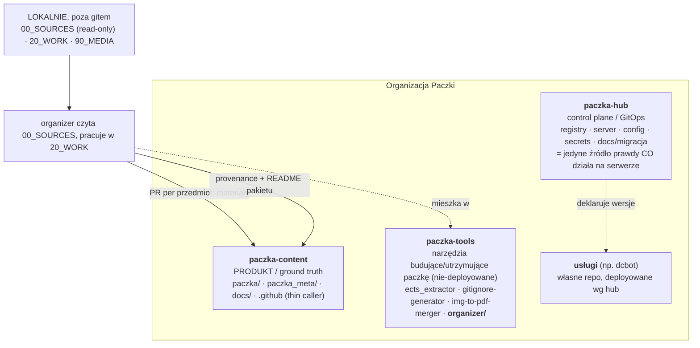

# ORGANIZACJA.md — struktura repozytoriów i organizacji

Dokument referencyjny dla agenta (Claude / Codex): gdzie co żyje, co wolno
ruszać, dokąd trafia wynik. **Living document** — aktualizuj, gdy struktura się
zmienia. Stan na: 2026-09-17.

> **Cel `apply` DZIŚ:** `10_NEW/PaczkaInfaPG/paczka` (lokalny klon `Billypl/PaczkaInfaPG`,
> ścieżka w `config/paths.yaml: target_repo`). Organizer pracuje w tym klonie **na branchu
> `subject/{SKROT}`**, nigdy na `master`; materiały wchodzą tylko przez `apply`, a na `master`
> tylko przez PR (`Closes #NN`). Opisane niżej `paczka-content` to cel **docelowy po migracji**
> monorepo — wtedy zmienia się jedna linia w `paths.yaml`.

> Uwaga: część repozytoriów jest w trakcie migracji ze starego monorepo
> `PaczkaInfaPG` do organizacji. Gdy stan faktyczny różni się od poniższego,
> traktuj rzeczywistość jako źródło prawdy i zaktualizuj ten plik.

## Mapa organizacji



## Repozytoria

### paczka-content — PRODUKT (ground truth) — DOCELOWO; dziś rolę pełni `PaczkaInfaPG/paczka`
Cienkie repo z gotową paczką. Docelowo tylko:
- `paczka/` — materiały, układ `SEM{n}/{SKROT}_{Nazwa}/...` (SEM5-7 mają dodatkowy
  poziom strumienia/katedry przed `{SKROT}_{Nazwa}`; patrz `config/syntax.yaml`)
- `paczka_meta/` — metadane pakietu: provenance dla użytkownika, README przedmiotów
- `docs/` — dokumentacja paczki
- `.github/` — **thin caller** do współdzielonych/reużywalnych workflowów
- LICENSE, README.md

Zasady dla agenta:
- To jest **kanoniczna paczka**. Ręcznie ułożone materiały = ground truth; nie
  ruszaj nazw/lokalizacji bez wyraźnej instrukcji.
- Organizer **nie commituje tu bezpośrednio** — produkuje **PR per przedmiot**
  (branch `subject/{SKROT}`, `Closes #issue`).
- Materiały → `paczka/`; provenance i README pakietu → `paczka_meta/`.
- Binaria (PDF/obrazy) tu wchodzą (to produkt). Duże media — NIE (patrz niżej).

### paczka-tools — NARZĘDZIA (tu żyje organizer)
Kolekcja niezależnych, nie-deployowanych narzędzi budujących/utrzymujących paczkę.
Każde narzędzie jest self-contained (własny `requirements.txt`/venv).
- `ects_extractor/` — buduje strukturę paczki z oficjalnej strony przedmiotów
- `gitignore-generator/`
- `img-to-pdf-merger/`
- **`organizer/`** — TEN projekt (migracja starych paczek). Zawiera scripts,
  config, prompts, docs, reports. Zasady pracy: `organizer/CLAUDE.md`.

Zasady dla agenta:
- Pracujesz TU (w `organizer/`). Kod, config, prompty, operacyjne raporty
  (manifesty/plany/provenance-operacyjne, tekstowe) commitujesz tutaj.
- **Nie wrzucaj tu binariów** materiałów — te idą do `paczka-content` przez PR.

### paczka-hub — CONTROL PLANE (GitOps)
Warstwa kontrolna infrastruktury: `registry` (deklaracja stanu — co i w jakiej
wersji działa na serwerze), `server`, zaszyfrowane sekrety, wspólna konfiguracja,
`docs/migracja`. Nie zawiera kodu usług.

Zasady dla agenta:
- Organizer **NIE należy do huba** — to offline'owy producent uruchamiany na
  żądanie, nie usługa serwerowa. Nie dodawaj go do `registry`.
- (Gdyby kiedyś część organizera działała jako scheduled job na serwerze — dopiero
  wtedy dostałby wpis w registry.)

### usługi (np. dcbot) — własne repo
Kod usług żyje osobno, deployment deklarowany w hubie. Poza zakresem organizera.

### PaczkaInfaPG — STARE monorepo (w rozbiórce) — ale DZIŚ to tu trafia wynik
Źródło migracji: `paczka/`, `docs/`, `utility/` (→ `paczka-tools`), itd. Docelowo
rozłożone na powyższe repo; `paczka-content` zostaje cienkie. Nie buduj tu nic
nowego **poza materiałami**: dopóki migracja trwa, `apply` organizera pisze do
`PaczkaInfaPG/paczka/` (klon w `10_NEW/`), na branchu `subject/{SKROT}`, PR do `master`.
Klon: `10_NEW/PaczkaInfaPG` (`config/paths.yaml: target_repo`).

## Katalogi lokalne (poza gitem, żadne repo)

Leżą w lokalnym katalogu roboczym `~/dev/paczka/PaczkaMerge/` (workspace, bez
własnego gita), ścieżki w `organizer/config/paths.yaml`:

```
PaczkaMerge/                  # workspace (nie repo)
├── 00_SOURCES/               # stare paczki, READ-ONLY, backup na Drive; hook blokuje zapis
├── 10_NEW/PaczkaInfaPG/      # klon celu (target_repo); apply pisze do paczka/ na branchu subject/*
├── 20_WORK/                  # organizer.sqlite, extracted_text/, thumbnails/ (odtwarzalne)
├── 90_MEDIA/                 # duże media wyjęte z paczki
└── paczka-tools/             # klon PGPaczka/paczka-tools
    ├── organizer/            # TEN projekt — tu odpalasz `just claude` / `just codex`
    └── multi-folder-downloader/  # pobieranie paczek z Drive → 00_SOURCES
```

- `00_SOURCES/` — stare paczki, **READ-ONLY**, backup na Google Drive. Nigdy nie
  modyfikować/kasować (`.agents/hooks/guard-sources.py` dla Claude/Codex +
  opcjonalnie `chmod -R a-w`).
- `20_WORK/` — `organizer.sqlite` (operacyjne źródło prawdy), extracted_text,
  thumbnails. Odtwarzalne, poza gitem.
- `90_MEDIA/` — duże wideo/audio wyjęte z paczki (> próg z `config/`). Nie wchodzą
  do repo docelowego; w paczce zostaje wpis w `inne/nagrania.txt`.

## Przepływ danych (skrót)

```
Google Drive (stare paczki)
   → 00_SOURCES (lokalnie, read-only)
   → organizer (paczka-tools/organizer): scan→dedup→classify→plan→apply, praca w 20_WORK
   → PR per przedmiot → 10_NEW/PaczkaInfaPG (paczka/)  [docelowo: paczka-content]
   → sync → Google Drive (finalna paczka)
```

## Co gdzie commitować — ściąga

| Artefakt | Repo / miejsce |
|---|---|
| kod organizera, config, prompty | `paczka-tools/organizer/` |
| manifesty, plany, provenance-operacyjne (JSONL/CSV) | `paczka-tools/organizer/reports/` |
| ręczne decyzje (`manual_decisions.jsonl`) | `paczka-tools/organizer/reports/` |
| materiały (PDF/obrazy) | `10_NEW/PaczkaInfaPG/paczka/` — branch `subject/{SKROT}`, PR (docelowo `paczka-content/paczka/`) |
| README przedmiotu, `inne/nagrania.txt` | obok materiałów w `paczka/` (przez ten sam PR) |
| provenance + README pakietu (dla użytkownika) | docelowo `paczka-content/paczka_meta/`; dziś `organizer/reports/provenance.jsonl` |
| baza `organizer.sqlite`, extracted_text, thumbnails | `20_WORK/` (poza gitem) |
| duże media | `90_MEDIA/` (poza gitem) |
| stare paczki | `00_SOURCES/` (poza gitem, read-only) |
