# Paczka Studio — ten sam proces, tylko w przeglądarce

Lokalny warsztat nad paczką: przeglądanie materiałów, porównywanie ich i podejmowanie
decyzji bez siedzenia w konsoli. Studio **nie jest drugim potokiem** — woła ten sam
kod co komendy z [`../docs/CLI.md`](../docs/CLI.md), pisze do tej samej bazy i
uruchamia te same skrypty. Zabiera konsolę, nie dokłada nowego świata.

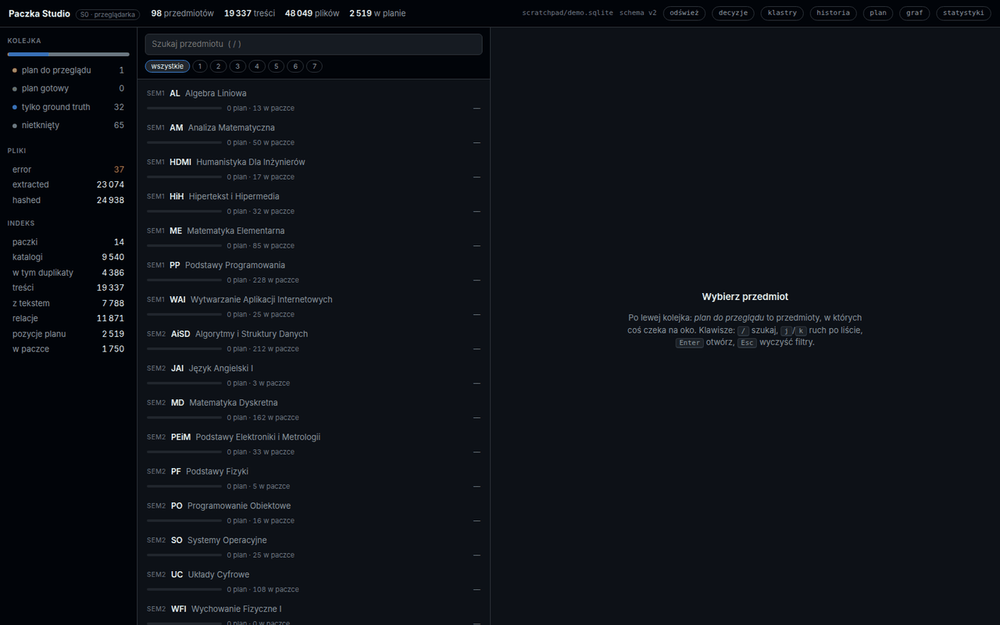

- plan i uzasadnienia decyzji: [`PLAN.md`](PLAN.md)
- stan prac i historia wpadek: [`TODO-studio.md`](TODO-studio.md)
- zasady dla agentów w tym zakresie: [`AGENTS.md`](AGENTS.md), [`CLAUDE.md`](CLAUDE.md)
- ten sam proces z konsoli: [`../docs/CLI.md`](../docs/CLI.md)

> **Zrzuty w tym pliku** powstały na **kopii** prawdziwego indeksu (stąd
> `scratchpad/demo.sqlite` w nagłówku) — liczby są realne, ale żadna pokazana tu
> decyzja nie dotknęła roboczej bazy.

---

## Spis treści

- [Start](#start) · [Recepty](#recepty) · [Flagi launchera](#flagi-launchera) · [Zmienne środowiskowe](#zmienne-środowiskowe)
- Widoki: [pulpit](#pulpit) · [decyzje](#kolejka-decyzji) · [klastry](#klastry) · [szukaj](#szukaj) · [plan](#plan-bramka-i-wykonanie) · [graf](#graf-jako-soczewka) · [historia](#historia) · [statystyki](#statystyki)
- [Klawiatura](#klawiatura-w-jednym-miejscu) · [Wąski ekran](#wąski-ekran)
- [Wydajność](#wydajność) · [Bezpieczeństwo](#bezpieczeństwo-czyli-czego-studio-nie-zrobi) · [API](#api) · [Baza](#baza-współdzielona-z-cli) · [Testy](#testy) · [Stan](#stan)

---

## Start

```bash
just studio-build     # front do postaci, którą serwuje `just studio` (po zmianach w web/)
just studio           # http://127.0.0.1:8765
```

Praca nad samym widokiem — backend z przeładowaniem + Vite z proxy na `/api`:

```bash
just studio-dev                  # backend 8765, front 5173
just studio-dev 8799 5199        # inne porty: backend, front
```

Zanim zajmiesz port — preflight (sprawdza adres i bazę, niczego nie uruchamia):

```bash
just studio --check
# ok: 127.0.0.1:8765 · baza /…/20_WORK/organizer.sqlite · schema_version=2
```

### Recepty

| Recepta | Co robi | Argumenty |
|---|---|---|
| `just studio *args` | uruchamia backend + zbudowany front | wszystko, co przyjmuje launcher (niżej) |
| `just studio-build` | `vite build` frontu do `studio/web/dist` | — |
| `just studio-dev [port] [web_port]` | backend `--reload` + Vite; sprząta backend po zamknięciu | domyślnie `8765` i `5173` |
| `just studio-graf *args` | vault z indeksu → generator → viewer zbudowany pod `/graf` | argumenty idą do `synapse_export.py` |
| `just studio-seed *args` | syntetyczna baza demo (~700 plików, ~20 przedmiotów) | `--db <ścieżka>`, `--force`, `--seed <int>` |

`studio-dev` startuje backend przez `setsid` i ubija go trapem: sam `TERM` na rodzica
nie zatrzymuje podprocesu przeładowywania uvicorna i po zamknięciu Vite zostawał
osierocony serwer.

`studio-graf` buduje z **kodu w tym repo** (`studio/graf/`): generator .NET robi
`graph.json` w `20_WORK/synapse/`, a viewer powstaje z `--base=/graf/`, bo studio
serwuje go pod tym prefiksem. Potrzebny toolchain .NET i node.

### Flagi launchera

`just studio <flagi>` albo wprost `.venv/bin/python -m studio.api <flagi>`:

| Flaga | Domyślnie | Znaczenie |
|---|---|---|
| `--host` | `127.0.0.1` | **wyłącznie** adres pętli zwrotnej; cokolwiek innego = odmowa startu, kod 2 |
| `--port` | `8765` | port nasłuchu |
| `--db` | `paths.yaml: work_db` | inna baza (np. kopia albo `studio-seed`) |
| `--reload` | wyłączone | przeładowanie po zmianie kodu (tryb deweloperski) |
| `--check` | — | tylko preflight: adres i baza; **nie zajmuje portu** |
| `--log-level` | `info` | poziom logów uvicorna |

Kody wyjścia: `0` wystartował albo `--check` przeszedł, `2` **odmowa** (adres spoza
pętli zwrotnej), `1` błąd środowiska (brak bazy, zła `schema_version`).

### Zmienne środowiskowe

| Zmienna | Gdzie działa | Do czego |
|---|---|---|
| `PACZKA_STUDIO_DB` | backend | ścieżka bazy dla podprocesu `--reload` (ustawia ją launcher) |
| `PACZKA_STUDIO_API` | `studio-dev` | adres backendu, na który Vite proxy'uje `/api` |
| `PACZKA_CONFIG_DIR` | cały potok | inny katalog `config/` — wskazuje studiu i etapom inny workspace |

---

## Widoki

Układ to trzy kolumny: **kolejka etapów** (po lewej), **lista przedmiotów** i **panel**,
który zmienia się wraz z zakładką. Zakładki `plan` i `graf` chowają listę przedmiotów —
potrzebują szerokości.

| Zakładka | Do czego służy | Klawisz |
|---|---|---|
| *(pulpit)* | przedmiot: liczniki, kategorie, rozkład pewności, pozycje planu | `b` (powrót) |
| **decyzje** | kolejka „jedna pozycja na ekranie”: podgląd + propozycja + decyzja | `d` |
| **klastry** | grupy near-duplicate z miniaturami, wybór wersji kanonicznej | `c` |
| **szukaj** | wyszukiwanie w całym indeksie, z miniaturami i skokiem do przedmiotu | `w` |
| **plan** | drzewo docelowe, diff, wynik bramki i uruchamianie etapów | `p` |
| **graf** | soczewka: osadzony viewer synapse, w obie strony po identyfikatorze | `g` |
| **historia** | co zmieniłeś dziś, cofanie pojedynczej pozycji | `h` |
| **statystyki** | odpowiednik `reports/STATUS.md` na żywo, bez generowania pliku | — |

**Wybór przedmiotu jest trzystopniowy**: semestr → strumień/katedra (SEM5–7) →
przedmiot. Wybór, zakładka i stan paneli **wracają po odświeżeniu strony**
(`localStorage`), więc na tablecie nie zaczynasz od nowa.

**Panele boczne zwijają się** do pionowych zakładek przy krawędzi (przyciski
`⟨kolejka⟩` i `⟨lista⟩` w nagłówku) — na mniejszym ekranie cała szerokość idzie do
panelu roboczego.

### Pulpit

Wybrany przedmiot: kafelki (w planie / do obejrzenia / już w paczce / nieaktualne),
rozkład pewności wg progów z `config/thresholds.yaml`, kategorie z licznikiem pozycji
do obejrzenia i lista pozycji z decyzją, powodem i ścieżką docelową.

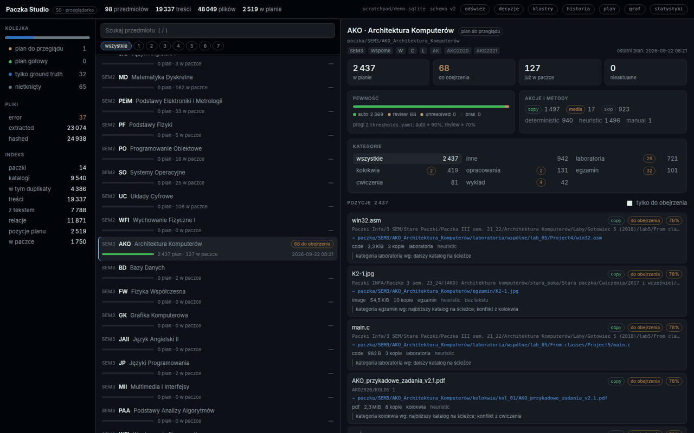

Lewa kolumna to **kolejka pracy**: etapy przedmiotów (`plan do przeglądu`,
`plan gotowy`, `tylko ground truth`, `nietknięty`) — kliknięcie filtruje listę —
oraz liczniki indeksu, te same, które pokazuje `just status`.

### Kolejka decyzji

Jedna pozycja na ekranie: **podgląd dokumentu po lewej**, propozycja potoku po prawej.
Podgląd to renderowana strona PDF (`←`/`→` przewraca strony), miniatura obrazu albo
głowa tekstu z etapu extract — czyli decydujesz, patrząc na dokument, a nie na nazwę pliku.

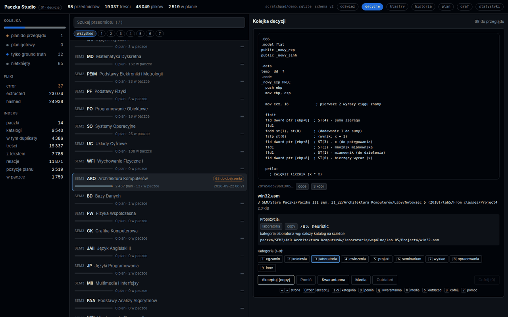

| Klawisz | Decyzja |
|---|---|
| `Enter` | akceptuj propozycję (`copy`) |
| `1`–`9` | akceptuj z wybraną kategorią |
| `s` | pomiń (`skip`) |
| `q` | kwarantanna |
| `m` | media (poza paczkę) |
| `o` | oznacz jako nieaktualne (`outdated`) |
| `t` | zmień ścieżkę docelową tej pozycji |
| `f` | decyzja dla całego katalogu źródłowego (najpierw podgląd, czego dotknie) |
| `u` | cofnij ostatnią decyzję |
| `←` / `→` | poprzednia / następna strona PDF |
| `?` | pomoc (pełna ściąga na ekranie) |

Ta sama kolejka dla pliku tekstowego: podglądem jest wtedy **głowa tekstu** z etapu
extract (tu: źródło w asemblerze), a `?` rozwija pod kartą pełną ściągę skrótów.

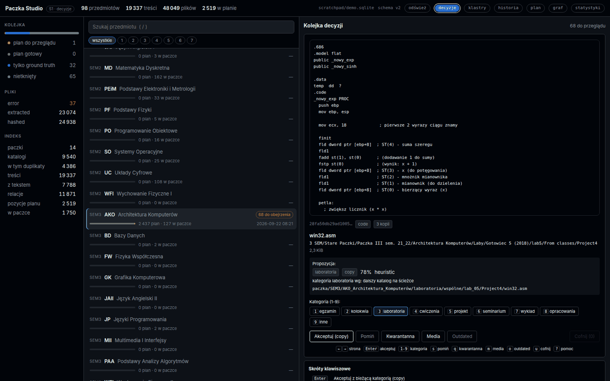

Tekstem pokazuje się **wszystko, co nie jest obrazem ani PDF-em**: md, txt, kod, pliki
projektowe. Gdy etap extract danej treści nie dotknął — a nie dotknął ani jednej treści
`other` i ponad dwustu `text`/`code` — studio czyta głowę **samego pliku źródłowego**,
tylko do odczytu i tylko wtedy, gdy bajty naprawdę są tekstem. `.obj`, `.jar` i reszta
binariów nadal uczciwie mówi „bez podglądu”, zamiast wysypywać bajty na ekran.

Nad tekstem stoi nazwa pliku i język; kolorowanie składni robi `highlight.js`, który
doczytuje się osobnym chunkiem dopiero przy pierwszym takim podglądzie. Język wybiera
**backend** (`preview.text_language`) — widok nie zgaduje po rozszerzeniu.

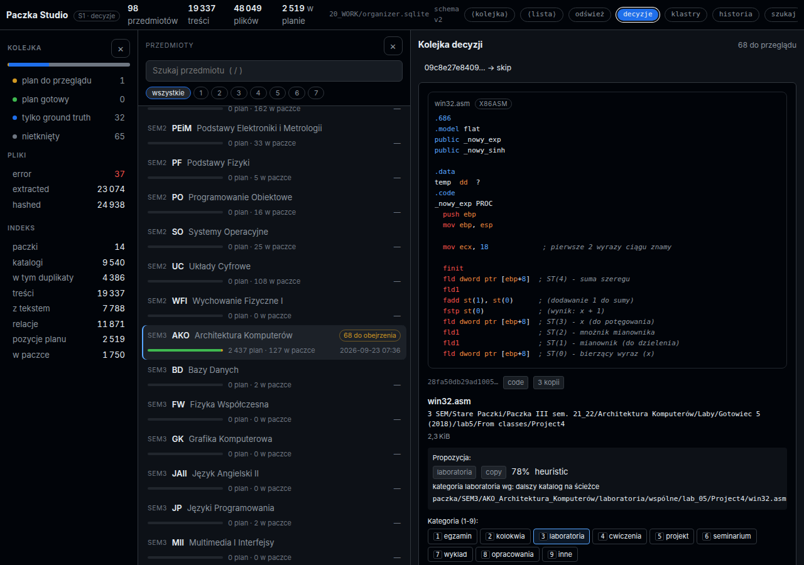

Decyzja idzie przez tę samą funkcję co `just subject-decide` (`orglib/decisions.py`):
ląduje w `manual_decisions`, w `classifications` (`classification_method='manual'`,
`confidence=1.0`) i w eksporcie `reports/manual_decisions.jsonl`. Wiersze
`run_id='ground_truth'` są chronione — próba nadpisania ręcznie ułożonego materiału
kończy się odmową (HTTP 409), nie zapisem.

Jest też **decyzja hurtem po katalogu źródłowym** (`f`): 2 570 treści to nie 2 570
decyzji, tylko kilkadziesiąt katalogów. Przed zapisem widzisz katalog, liczbę pozycji
i próbkę nazw; treści z ground truth są pomijane, żeby nie nadpisać paczki.

Kliknięcie podglądu (albo lupki `⤢`) otwiera **pełny ekran** — bo miniatura mówi
„co to jest”, a dopiero duży obraz „czym te dwa skany się różnią”.

### Klastry

Relacje podobieństwa sklejone w grupy (union-find z `orglib/review.py` — bez drugiej
implementacji). Nagłówek mówi, ile treści liczy klaster, jakiego jest rodzaju
(`wersje` / `duplikaty`) i z jaką pewnością.

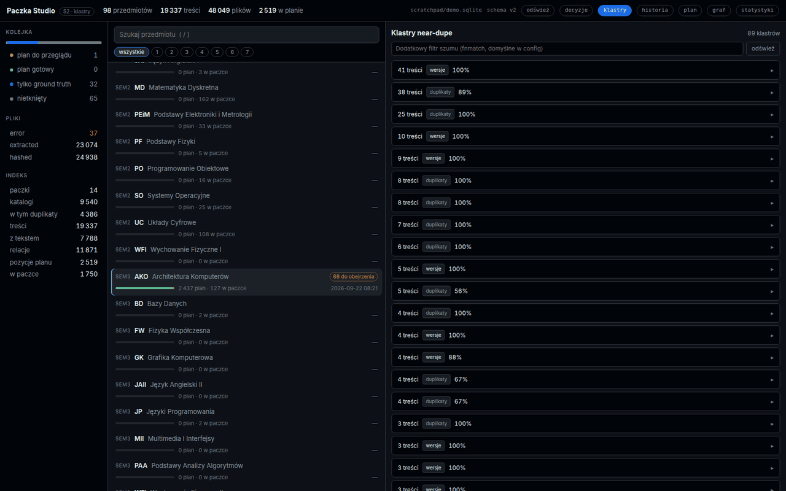

Rozwinięty klaster to siatka kart z **miniaturą** (zdjęcie, skan, pierwsza strona PDF),
nazwą, rodzajem, rozmiarem i pewnością oraz lista relacji z **metodą wykrycia** — `simhash, odległość 0`, `phash, odległość 8; rok 2020 vs 2021`,
`ten sam tekst po normalizacji`. Kliknięcie karty wskazuje wersję kanoniczną; reszta
dostaje `skip` albo relację `older_version`.

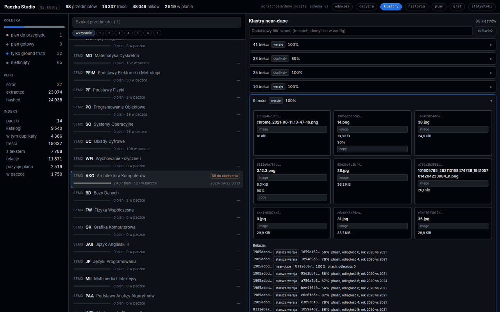

Porównanie pary pokazuje obie treści obok siebie: **dwa obrazy** dla zdjęć i skanów,
dwie głowy tekstu dla dokumentów — po to, żeby „która wersja jest nowsza” (albo „czy to
w ogóle ten sam materiał”) dało się rozstrzygnąć bez otwierania plików.

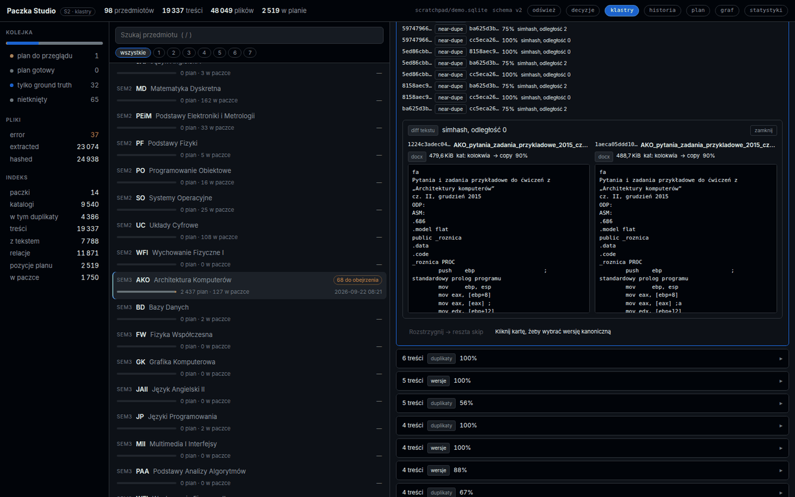

Pole u góry to **dodatkowy filtr szumu** (fnmatch). Domyślne wzorce siedzą
w `config/thresholds.yaml: near_duplicate.noise_patterns` (`*.vcxproj*`, `*.sln`,
`__pycache__`, …) — bez nich największy klaster w paczce to pliki projektowe Visual Studio.

### Plan, bramka i wykonanie

To tutaj zapada decyzja o ruszeniu materiałów.

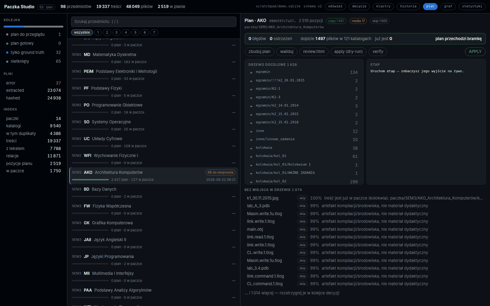

- **nagłówek**: odcisk planu (`plan_hash`), liczba pozycji, rozkład akcji;
- **bramka**: błędy i ostrzeżenia z `validate_plan` + diff wykonania (ile dojdzie, ile
  już jest, ile kolizji, ile bez źródła). Pasek jest zielony tylko wtedy, gdy plan
  naprawdę przechodzi;
- **drzewo docelowe**: katalogi zwinięte z licznikami; `+` dojdzie, `=` już jest,
  `·` ground truth, `!` zatrzyma `apply`;
- **bez miejsca w drzewie**: pozycje `skip`, `quarantine` i te do obejrzenia, z powodem
  decyzji reguł.

Etapy uruchamiają **prawdziwe skrypty potoku** jako podproces; log leci na żywo, a wynikiem
jest **kod wyjścia**, nie treść logu:

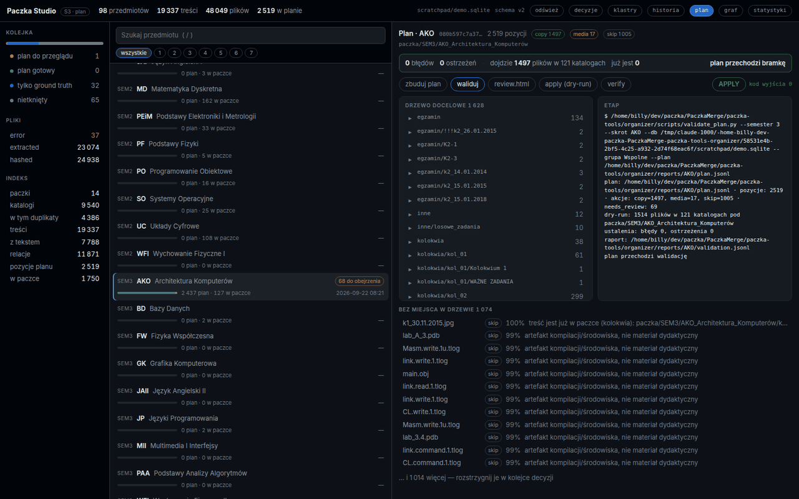

| Przycisk | Skrypt | Uwagi |
|---|---|---|
| `zbuduj plan` | `build_plan.py` | scala decyzje w jeden `plan.jsonl` |
| `waliduj` | `validate_plan.py` | bramka; kod 2 = planu nie wolno wykonać |
| `review.html` | `review_report.py` | samowystarczalna strona przeglądu |
| `apply (dry-run)` | `apply.py` bez `--yes` | niczego nie kopiuje, zapisuje snapshot |
| `APPLY` | `apply.py --yes --expect-hash …` | pyta o potwierdzenie; kopiuje materiały |
| `verify` | `verify.py` | hash po kopii wobec planu |

**Bramka jest po stronie serwera.** `APPLY` bywa wyszarzony, ale to nie jest
zabezpieczenie: żądanie wysłane z pominięciem interfejsu też dostaje odmowę (HTTP 409)
i **żaden podproces nie startuje**. Zgoda dotyczy konkretnego planu — żądanie musi nieść
`plan_hash`, który widziałeś; plan przebudowany po akceptacji jest odmową, a nie „tym
samym planem”. Pilnuje tego mutacja `tests/mutations/studio-apply-gate.yaml`.

**„Przenieś tu”**: wybierasz pozycję z listy „bez miejsca”, potem katalog w drzewie
(przycisk `tu`). Studio pokazuje ścieżkę, pod którą pozycja wyląduje, i **blokuje zapis
przy kolizji nazwy**.

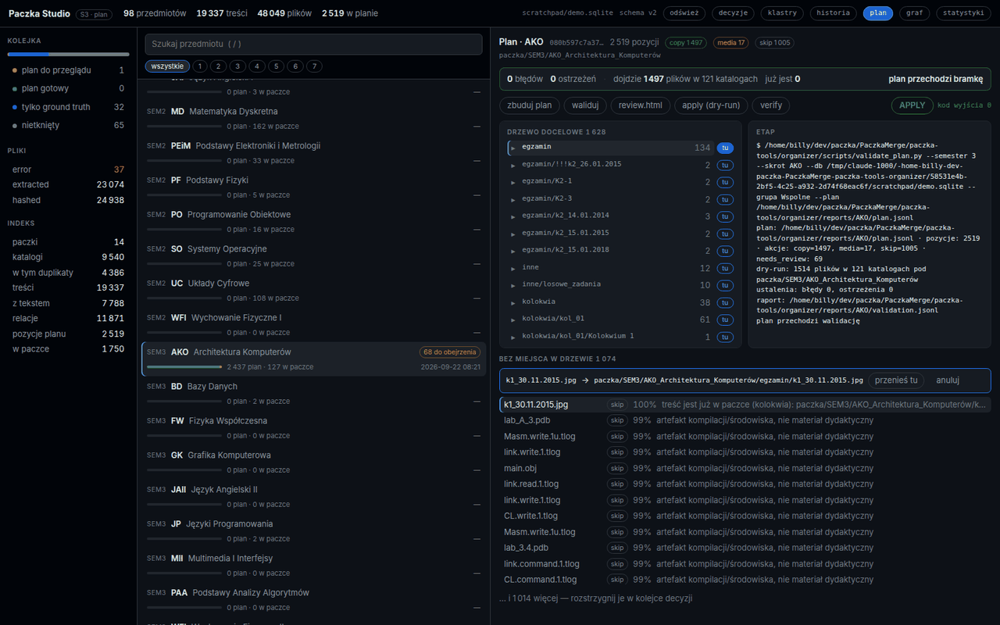

Zapis idzie zwykłą decyzją ręczną, więc **wchodzi do drzewa dopiero po przebudowaniu
planu** — widok mówi to wprost po zapisaniu.

### Szukaj

Zakładka **szukaj** (klawisz `w`) przeszukuje **cały indeks**, nie tylko wybrany
przedmiot: po nazwie, ścieżce źródłowej, kategorii i skrócie sha. Wyniki mają
miniatury, decyzję potoku i przycisk „otwórz”, który przenosi do przedmiotu danej treści.

### Graf jako soczewka

```bash
just studio-graf        # vault z indeksu → generator → viewer zbudowany pod /graf
```

Zakładka **graf** osadza **zbudowany viewer synapse** (studio niczego nie rysuje po
swojemu) i łączy się z nim w obie strony po tym samym identyfikatorze treści. Źródła
viewera i generatora są w repo: `studio/graf/` — wciągnięte jako `git subtree` z gałęzi
`feat/paczka-integration` repo `Billypl/synapse`, bo są przerobione pod nas.

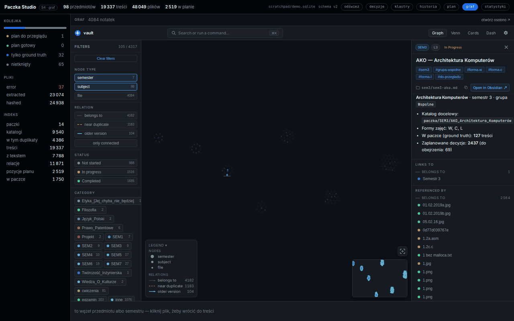

- **studio → graf**: wybrany przedmiot otwiera graf na jego węźle (`/graf#sem3-ako`);
- **graf → studio**: kliknięty węzeł pliku ląduje w pasku pod grafem jako konkretna treść —
  nazwa, kategoria, decyzja, pewność i ścieżka docelowa — z przyciskiem „otwórz przedmiot”.

Na ekranie dotykowym **jeden palec przesuwa, dwa skalują** (sufit powiększenia
podniesiony z 2,6 do 6 — przy czterech tysiącach węzłów węzeł ma kilka pikseli, podłoga
obniżona do 0,04, bo paczka otwiera się przy 0,06 i trzeba umieć wrócić do całości).
Zoom przeglądarki nie jest zamiennikiem: skaluje gotowy raster, czyli rozmazuje.

Przy dużym zakresie (np. przedmiot z 2,5 tys. plików) graf rysuje się **w takim
szczególe, jaki widać**: węzeł mniejszy niż cztery piksele jest kropką, groty strzałek
pojawiają się dopiero przy odpowiednim powiększeniu, krawędzie o tym samym wyglądzie idą
jedną ścieżką, a to, co poza ekranem, nie jest rysowane wcale. Po przybliżeniu odpadają
też linie dłuższe niż półtorej przekątnej ekranu — ich drugiego końca i tak nie widać,
a to one kosztują najwięcej (układ jest gwiazdą: każdy plik ma szprychę do przedmiotu).
Nazwy węzłów pojawiają się wtedy, gdy węzeł jest dość duży na ekranie, a nie zależnie od
tego, ile pozycji przepuścił filtr. Układanie grafu **ustępuje
ręce** — dotknięcie płótna wstrzymuje symulację, puszczenie wznawia. Zmierzone przy
dławieniu CPU ×4: liczba przerysowań grafu przy przesuwaniu 4,2 → 16,4 na sekundę, a układ,
który wcześniej nie kończył się przez 45 s, staje w ~10 s. Minimapa rysuje się na canvasie
(dwie warstwy: układ w bitmapie, ramka widoku na wierzchu) — jako SVG miała ~10 000
elementów DOM przemalowywanych przy każdej klatce przesuwania i to ona, a nie graf,
odpowiadała za większość zacięć na telefonie.

Na telefonie dochodzi gęstość pikseli: przy `devicePixelRatio` 3 każda klatka to
dziewięciokrotność pracy laptopa, więc rysowanie jest ograniczone do dpr 2, a przy wolnych
klatkach schodzi do 1 i wraca, gdy graf się uspokoi. Gdy coś mimo to zwalnia, otwórz
**`/graf/?diag=1`** — w rogu pojawią się liczby z TEGO urządzenia: przerysowania na
sekundę, czas rysowania w ms, liczba węzłów i krawędzi, zoom i realna gęstość pikseli.

**Hierarchia ma cztery poziomy: semestr → przedmiot → kategoria → plik.** Kategoria
(`Kolokwia`, `Laboratoria`, `Wykład`…) jest węzłem pośrednim: bez niej przedmiot był
gwiazdą o dwóch i pół tysiącach szprych — nieczytelną i drogą w rysowaniu, bo każda
szprycha biegła przez pół grafu. Teraz przedmiot pokazuje kilka podpisanych skupisk,
a pliki leżą przy swojej kategorii.

**Zakres: semestr → przedmiot → kategoria.** Dwa pola na górze panelu filtrów wybierają, nad czym
pracujesz; lista przedmiotów zawęża się do wybranego semestru, lista kategorii do wybranego
przedmiotu, a wejście w kategorię samo odsłania typ `file`. Oba filtry działają na tagach, które niesie **każdy poziom** (`sem3`,
`ako`), więc wybór bierze przedmiot razem z materiałami. Filtrowanie po `category` tego nie
umiało i wyglądało na zepsute: `SEM3` mają wyłącznie węzły przedmiotów, więc „SEM3 + pliki”
odpowiadało przedmiotami i zerem plików. Po zmianie filtra widok **dojeżdża do tego, co
zostało widoczne** — odfiltrowane węzły znikają, zamiast robić kurz dookoła.

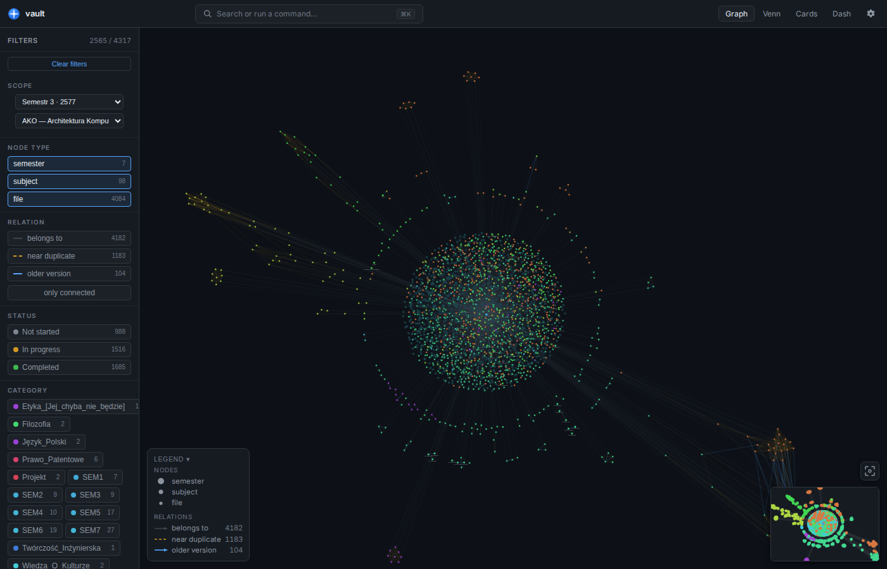

Wybór kategorii odsłania jej pliki — 147 egzaminów AKO zamiast 2,5 tysiąca wszystkiego:

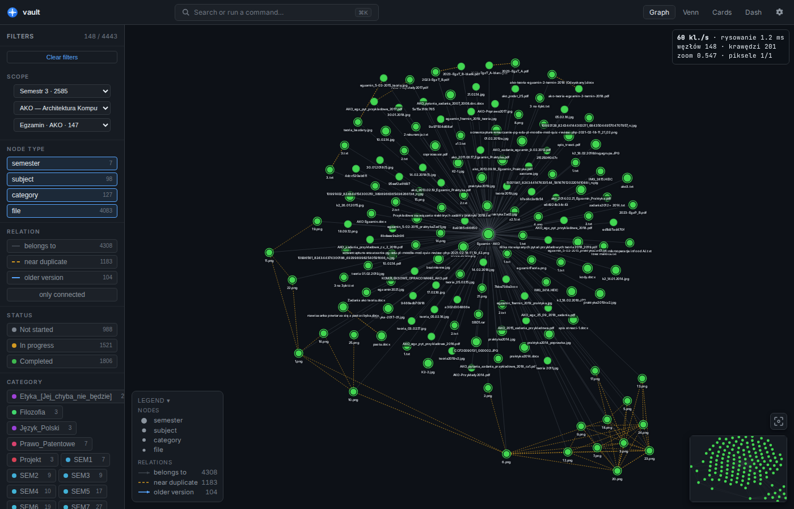

Tłumaczenie `sha256` ↔ `id` notatki stoi na kontrakcie vaulta: id notatki pliku kończy się
`sha256[:8]` (`orglib/synapse_vault.ID_SHA_PREFIX`). Gdy skrót pasuje do kilku treści,
studio **pokazuje kandydatów zamiast wybierać**. Notatki serwuje samo studio
(`/vault/...`) prosto z `20_WORK/synapse/vault`, przez ten sam helper containmentu co podgląd.

`dist/` powstaje z builda i jest poza gitem, więc w świeżym klonie grafu jeszcze nie ma —
zakładka mówi wtedy, co uruchomić, zamiast pokazywać pustą ramkę. Dane grafu studio czyta
**wyłącznie** z `20_WORK/synapse/`: przykładowy `graph.json` upstreamu nie jest ścieżką
awaryjną, bo cichy cudzy graf byłby gorszy niż komunikat „zbuduj”.

### Historia

Co zmieniłeś i kiedy, z filtrem daty i cofaniem pojedynczej pozycji.

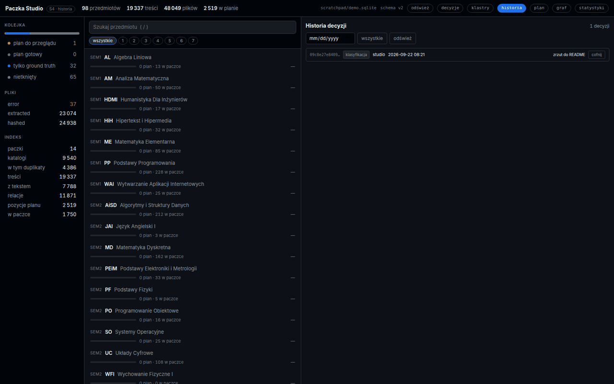

### Statystyki

Odpowiednik `reports/STATUS.md` na żywo, bez generowania pliku: liczniki ogólne, etapy
przedmiotów, statusy plików, metody klasyfikacji, kategorie i akcje. Liczone
`status_report.collect`, czyli tym samym kodem co `just status`.

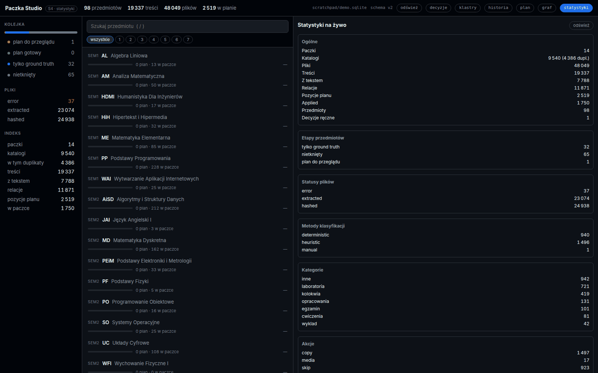

---

## Klawiatura w jednym miejscu

| Klawisz | Gdzie | Co robi |
|---|---|---|
| `/` | lista przedmiotów | szukaj |
| `j` / `k`, `↓` / `↑` | lista przedmiotów | poprzedni / następny przedmiot |
| `Enter` | wyszukiwarka | otwórz pierwszy wynik |
| `Esc` | wszędzie | wyczyść filtry |
| `d` | pulpit | kolejka decyzji |
| `w` | pulpit | szukaj w całej paczce |
| `c` | pulpit | klastry |
| `p` | pulpit | plan |
| `g` | pulpit | graf |
| `h` | pulpit | historia |
| `b` | dowolna zakładka | powrót na pulpit |

W kolejce decyzji obowiązuje dodatkowo [jej własna ściąga](#kolejka-decyzji).

## Wąski ekran

Poniżej ~1100 px kolejka etapów startuje **zwinięta** (jest powtórzona jako filtr),
a karta pozycji układa się w jedną kolumnę — **podgląd nigdy nie znika**, bo bez niego
nie ma po czym decydować.

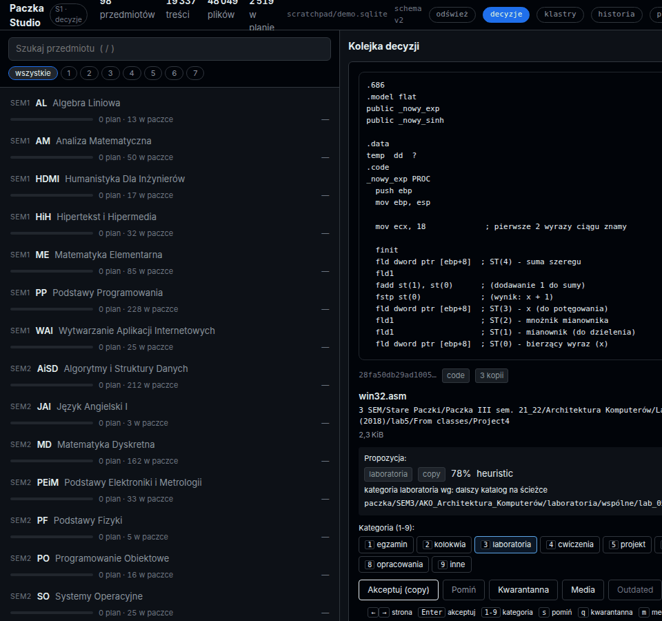

Zwinięty panel stoi przy krawędzi jako pionowa zakładka; klik ją rozwija, `×` w nagłówku
zwija z powrotem. Stan panelu trzyma aplikacja i zapisuje go w `localStorage` —
to nie jest reguła CSS-a. Wcześniej była i wychodziło z tego zwijanie, które „nie
działa”: panel dawało się rozwinąć, ale `@media (max-width: 1100px)` i tak go gasił.

Poniżej 700 px panele wjeżdżają **nad** panel roboczy zamiast zabierać mu kolumnę, a
strona jest domknięta do szerokości ekranu (pasek zakładek przewija się w poziomie
zamiast rozpychać układ). Dzięki temu wbudowany graf dostaje pełną szerokość:

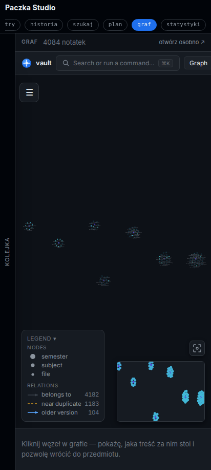

---

## Wydajność

Zmierzone na realnym indeksie (19 337 treści) i naprawione 2026-09-22, po zgłoszeniu
„długo się wczytuje na tablecie”:

| Odpowiedź | Było | Jest |
|---|---:|---:|
| `graph.json` (zakładka graf) | 4381 KiB | **241 KiB** |
| drzewo planu przedmiotu | 721 KiB | **137 KiB** |
| klastry przedmiotu | 432 KiB | **33 KiB** |
| pulpit `/api/subjects` | 43 KiB | **3 KiB** |
| strona PDF w podglądzie | 1006 KiB | **110 KiB** |

Skąd to się bierze: **gzip** na całej aplikacji (JSON kompresuje się kilkunastokrotnie),
**JPEG zamiast PNG** przy renderowaniu stron PDF i **`width` dopasowany do ekranu**, więc
tablet nie pobiera renderu jak monitor. Miniatury w klastrach dochodzą leniwie,
z licznikiem „podglądy: 5 / 9”, żeby było widać, że coś się dzieje.

## Bezpieczeństwo, czyli czego studio nie zrobi

- **Serwer stoi wyłącznie na pętli zwrotnej.** Adres spoza `127.0.0.0/8`/`::1` to odmowa
  startu z kodem 2, nie ostrzeżenie (`just studio --host 0.0.0.0` nie wystartuje). Na tym
  założeniu stoi decyzja, że studio nie ma kont, autoryzacji ani CORS-a.
- **Nie edytuje materiałów.** Jedyna droga do repo paczki to plan → akceptacja → `apply`,
  a `apply` i tak sprawdza bramkę u siebie i nie commituje.
- **Nie kasuje niczego w bazie** — rozstrzygnięcia dopisują decyzje i relacje.
- **Nie liczy niczego, czego nie policzył `orglib`** — kategorie, progi, klastry, kubełki
  pewności i diff planu przychodzą gotowe z API. Pierwsza reguła policzona w JS oznacza
  dwie klasyfikacje dające różne wyniki.
- **Podgląd i vault sięgają po pliki tylko do odczytu**, wyłącznie po te obecne w indeksie
  i przez wspólny helper containmentu (`config.resolve_within`): wpis prowadzący poza swoje
  drzewo — bezwzględny, przez `..` albo przez dowiązanie — nie jest czytany.
- Nie ma logowania, kont ani pracy wielu osób. To `localhost`, jeden człowiek.

---

## API

Wszystko pod `http://127.0.0.1:8765`. Parametry opcjonalne oznaczone `?`.

### Odczyt

| Endpoint | Parametry | Zwraca |
|---|---|---|
| `GET /api/health` | — | czy backend widzi bazę i jej `schema_version` |
| `GET /api/subjects` | — | pulpit: liczniki, przedmioty × etapy, kolejka „co następne” |
| `GET /api/subjects/{sem}/{skrot}` | `grupa?` | jeden przedmiot (409 przy wieloznacznym skrócie) |
| `GET /api/items` | `semester? skrot? category? action? status? kind? needs_review? classified? confidence_min? confidence_max? include_ground_truth?=false limit?=50 offset?=0` | treści po filtrach |
| `GET /api/items/{sha256}` | — | decyzja, wszystkie kopie, relacje, plan, ślad `apply` |
| `GET /api/preview/{sha256}` | — | głowa tekstu, rodzaj podglądu, liczba stron |
| `GET /api/preview/{sha256}/image` | `page?=1 width?` | strona PDF jako PNG albo obraz; `width` (80–2000) dla siatek i porównań |
| `GET /api/queue` | `semester? skrot? limit?=1` | kolejka decyzji |
| `GET /api/clusters` | `semester? skrot? noise?` | klastry near-dupe |
| `GET /api/clusters/diff` | `left right` | dwie treści obok siebie + relacja |
| `GET /api/search` | `q limit?=50` | wyszukiwanie przekrojowe |
| `GET /api/stats` | — | liczby jak w `STATUS.md` |
| `GET /api/decisions/history` | `decided_by? since? limit?=100 offset?=0` | historia decyzji |
| `GET /api/decisions/by-folder` | `folder` | co obejmie decyzja hurtowa |
| `GET /api/plan/{sem}/{skrot}` | `grupa?` | plan: nagłówek, bramka, diff wykonania |
| `GET /api/plan/{sem}/{skrot}/tree` | `grupa?` | drzewo docelowe + pozycje bez miejsca |
| `GET /api/graph/status` | — | czy graf zbudowany, ile notatek |
| `GET /api/graph/node/{sha256}` | — | węzeł grafu dla treści |
| `GET /api/graph/subject/{sem}/{skrot}` | `grupa?` | węzeł przedmiotu |
| `GET /api/graph/content/{node_id}` | — | treść pokazana przez węzeł |

### Zapis — wyłącznie decyzje, nigdy materiały

| Endpoint | Ciało | Działanie |
|---|---|---|
| `POST /api/decisions` | `sha256 decision_type` + `semester? subject_key? category? target_relative_path? action? note? decided_by?` | jedna decyzja |
| `POST /api/decisions/batch` | `decisions[] decided_by?` | partia (atomowo) |
| `POST /api/decisions/by-folder` | `folder decision_type?=skip` + pola jak wyżej | decyzja hurtem |
| `POST /api/decisions/undo` | — | cofnięcie ostatniej |
| `DELETE /api/decisions/{sha256}` | — | cofnięcie jednej pozycji |
| `POST /api/clusters/resolve` | `canonical_sha256 members[] decided_by?` | rozstrzygnięcie klastra |
| `POST /api/plan/{sem}/{skrot}/run` | `stage` + dla `apply`: `confirm plan_hash` | etap jako podproces CLI, log strumieniem SSE |

`stage` to jedna z: `plan`, `validate`, `review`, `apply-dry`, `apply`, `verify` —
zamknięta lista; cokolwiek innego to 422, nie komenda.

Strumień etapu to ramki SSE: `start` (pełne argv — widać dokładnie, co zostało
uruchomione), `line` (kolejne linie wyjścia), `done` (`code` — kod wyjścia etapu).

---

## Baza współdzielona z CLI

Studio i komendy z [`../docs/CLI.md`](../docs/CLI.md) piszą do tego samego
`20_WORK/organizer.sqlite` (WAL). Przy starcie backend sprawdza `schema_version`
i odmawia startu, gdy baza jest z innej wersji schematu — po migracji część zapytań
odpowiadałaby, a reszta milczała, co jest najgorszym rodzajem pomyłki w narzędziu,
na którym opiera się decyzja o `apply`.

Można spokojnie trzymać studio otwarte i równolegle uruchamiać etapy z konsoli;
`odśwież` w nagłówku przelicza liczby z bazy.

Chcesz poklikać bez ryzyka? `just studio-seed` robi syntetyczną bazę, a
`just studio --db /ścieżka/do/kopii.sqlite` uruchamia studio na kopii.

---

## Testy

```bash
just test-fast                       # w tym kontrakt API ↔ orglib
just cli-check                       # launcher studia + prawdziwy start serwera
npm --prefix studio/web run test     # vitest
npm --prefix studio/web run check    # svelte-check
```

Kontrole, które nie mogą zniknąć wraz z refaktorem, mają własne mutacje
(`just mutate-check`):

| Mutacja | Czego pilnuje |
|---|---|
| `studio-loopback-only.yaml` | odmowa startu na adresie spoza pętli zwrotnej |
| `studio-preview-containment.yaml` | podgląd i diff czytają wyłącznie z drzewa `work` |
| `studio-vault-containment.yaml` | `/vault/...` nie jest drogą do innych plików |
| `studio-apply-gate.yaml` | `apply` nie rusza przy planie odrzuconym przez bramkę |

Widoki sprawdzaj **oczami na realnych danych** — przy 4 189 węzłach grafu cztery realne
wady wyszły dopiero w przeglądarce, a robienie zrzutów do tego pliku wykryło piątą:
diff klastra nie pokazywał tekstu, mimo zielonego testu na ścieżce, której potok nie
produkuje.

---

## Stan

Zrobione: **S0** (szkielet, tylko odczyt), **S1** (kolejka decyzji z podglądem),
**S2** (porównywarka klastrów), **S3** (plan, bramka, apply) i **S4** (graf, historia,
wyszukiwanie, statystyki) — czyli cały plan z [`PLAN.md`](PLAN.md).

Co dalej: pilotaż AKO od początku do końca z tego widoku (D1 w `../TODO.md`) i to, co
z niego wyjdzie. Historia decyzji i wpadek: [`TODO-studio.md`](TODO-studio.md).
